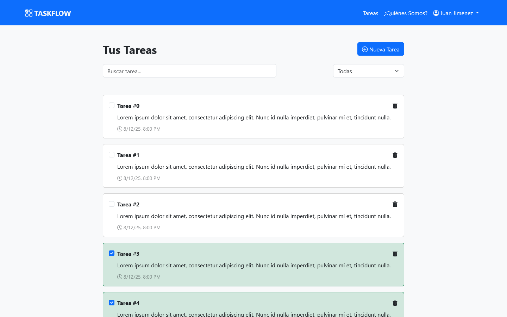

# TodoApp

Todo List project made using Angular 19 and Bootstrap. The app consist of three pages:

- Login/Register
- Task List
- About Us

## Features

- Create new tasks, each of which has a title, a description and a due date.
- Mark tasks as completed.
- Filter tasks by title or completion status.
- Create your own account which is saved in Local Storage.

## Links

Github repo: https://github.com/UnUsuarioMas67/todo-app-angular \
Live Netlify site: https://sweet-boba-31a6a3.netlify.app
